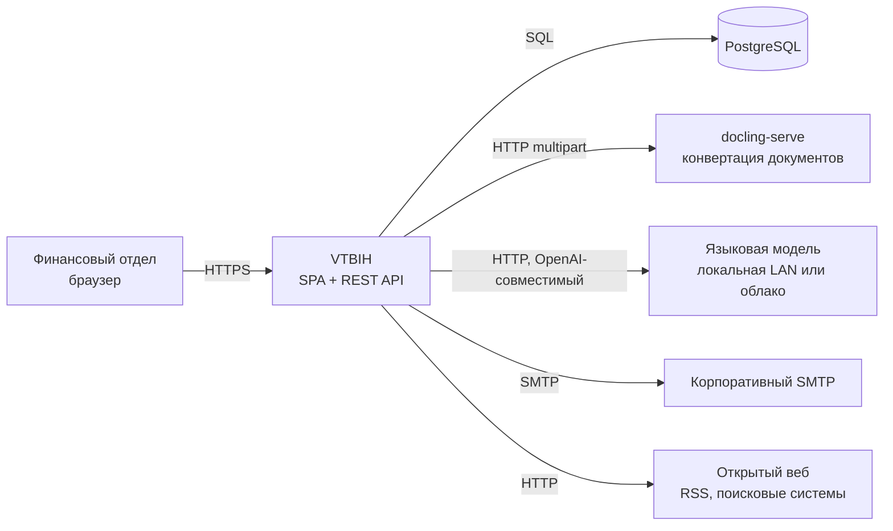
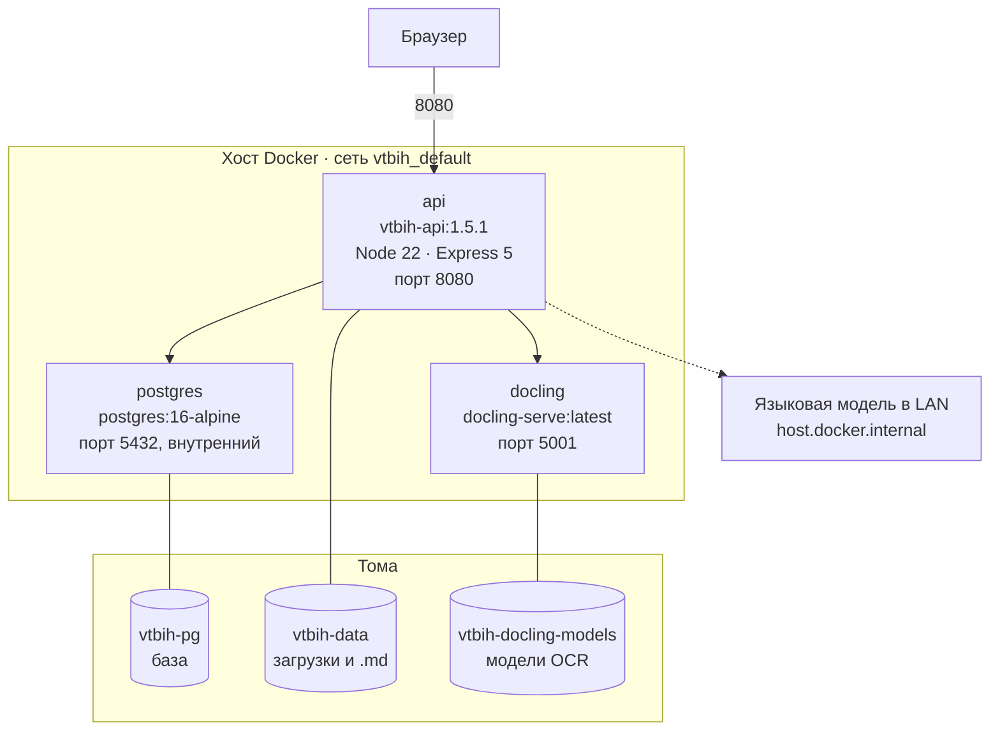
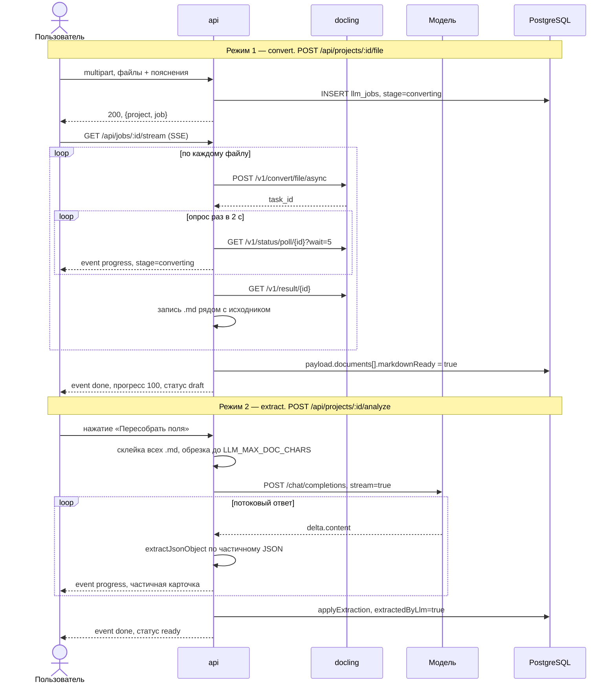
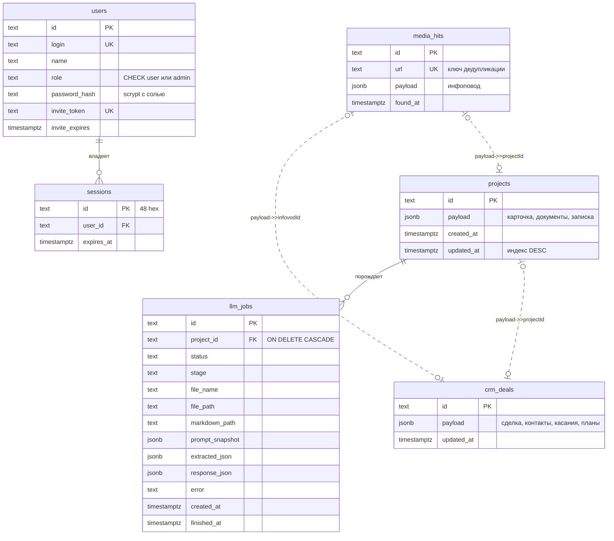

# VTBIH — архитектурная документация

Версия системы: **1.5.1**. Документ описывает фактическую реализацию в репозитории, а не целевое состояние.

Смежные документы: [руководство пользователя](user-guide.md), [развёртывание](deployment.md).

---

## 1. Назначение

Система помогает финансовому отделу принимать решение по концессионным соглашениям. Пользователь загружает договор или финансовую модель, система превращает документ в текст, извлекает из него параметры проекта силами языковой модели и выстраивает объекты в рейтинг по взвешенной оценке финансовых метрик.

Вокруг этого ядра надстроены два вспомогательных модуля: мониторинг СМИ (поиск потенциальных концессий в публикациях) и CRM (работа с контрагентами по найденным объектам).

Ключевое архитектурное решение: **система не считает финансовую модель сама**. Она извлекает уже посчитанные метрики из документа, ставит им баллы через LLM и взвешивает их по настраиваемым весам. Вся содержательная оценка — на стороне модели и на стороне человека, который правит карточку руками.

---

## 2. Контекст



| Внешняя система | Обязательна | Что произойдёт без неё |
|---|---|---|
| PostgreSQL | да | API не стартует, процесс завершается с кодом 1 |
| docling-serve | практически да | PDF, DOCX, XLSX не обрабатываются; CSV, MD, TXT читаются напрямую |
| Языковая модель | нет | вместо разбора работает эвристика по имени файла, записка не заполняется |
| SMTP | нет | недоступна отправка писем из CRM |
| Открытый веб | нет | не работает мониторинг СМИ |

---

## 3. Компоненты развёртывания



Контейнер `api` отдаёт и статику собранного фронтенда, и REST API — отдельного веб-сервера нет. `express.static` регистрируется **после** всех маршрутов `/api`, поэтому SPA-фолбэк не может перехватить обращения к API (`server/index.js:779-787`).

Внутри `docker-compose.yml` `api` обращается к соседям по именам сервисов: `postgres:5432` и `http://docling:5001`. Для доступа к языковой модели, работающей на самом хосте, объявлен `extra_hosts: host.docker.internal:host-gateway`.

---

## 4. Технологический стек

| Слой | Технология | Версия |
|---|---|---|
| Фронтенд | React + React Router | 19.1 / 7.8 |
| Сборка | Vite + TypeScript | 7.1 / 5.9 |
| Бэкенд | Express | 5.2 |
| Загрузка файлов | multer | 2.3 |
| БД | PostgreSQL + pg | 16 / 8.23 |
| Почта | nodemailer | 10.0 |
| Тесты | Vitest | 5.0 |
| Рантайм | Node.js | 22 |

Внешних зависимостей минимум: нет ORM, нет менеджера миграций, нет библиотеки логирования, нет `dotenv` (свой парсер `.env` в `server/config.js:7-27`), нет `cookie-parser` (свой разбор Cookie в `server/auth.js:44-60`), нет библиотеки валидации — вся нормализация написана вручную в `crm.js`, `extractPrompt.js`, `mediaPrompt.js`.

---

## 5. Конвейер обработки документа

Это центральный сценарий системы. Он состоит из **двух независимо запускаемых режимов**, и это важно понимать: загрузка файла НЕ вызывает языковую модель автоматически.



### Стадии

Имена стадий — строковые литералы `converting`, `extracting`, `done`, `error`. Они одновременно лежат в `llm_jobs.stage`, в `projects.payload.pipelineStage` и уходят в событиях SSE, поэтому фронтенд и БД говорят на одном языке без словарей соответствия.

Прогресс распределён так: конвертация занимает диапазон 8–55 %, извлечение 58–92 %, завершение выставляет 100 %. Формулы в `server/pipeline.js:105-125` и `:177`.

### Очередь

Задачи одного проекта строго последовательны: `index.js:159-163` держит `Map` промисов по `projectId`, и новая задача ожидает завершения предыдущей. Задачи разных проектов идут параллельно без ограничения по числу — пула воркеров нет.

### Обрыв и прекращение

`server/pipeline.js:11` хранит реестр `AbortController` по проекту. Новый запуск прерывает предыдущий (`beginRun`, строка 41), удаление проекта вызывает `abortPipeline` (`index.js:321`). Кнопки «отменить» в интерфейсе нет — прервать разбор можно только удалением проекта или перезапуском контейнера.

### Обработка ошибок

Все сбои конвейера оборачиваются в `PipelineError(failedAt, message, details)` — `server/httpErrors.js:1-11`. Сообщения намеренно содержат номер этапа, чтобы пользователь без чтения логов понимал, где встала обработка:

```
Этап 1/2 Docling — нет готового Markdown…
Этап 2/2 Локальная Qwen — Markdown уже сохранён (2 файл., 668 573 симв.), ошибка на модели
```

`describeNetworkError` (`httpErrors.js:13-36`) переводит коды сетевых ошибок в человеческий текст: `ECONNREFUSED` → «недоступен», `TimeoutError` → «не ответил вовремя», `ENOTFOUND` → «хост не найден», с добавлением URL и кода.

При падении обработчик в `index.js:213-252` помечает конкретный документ как `status: error`, ставит проекту `status: error`, `pipelineStage: error`, `pipelineFailedAt`, сохраняет уже полученный `markdownPreview` (чтобы результат первого этапа не потерялся) и закрывает поток событием `failed`.

### Повторные попытки

Автоматических повторов на уровне конвейера нет. Три точки отказоустойчивости ниже:

- Docling: при HTTP 404 на асинхронный эндпоинт происходит переход на синхронный (`docling.js:152`);
- LLM: при HTTP 400 запрос повторяется один раз без `response_format` и `enable_thinking` — для моделей, не поддерживающих эти поля (`qwen.js:169-173`);
- веб-поиск: DuckDuckGo → Bing.

---

## 6. Модель данных

Подход документо-ориентированный: сущность целиком сериализуется в `payload JSONB`, в реляционных колонках остаются только идентификаторы и поля сортировки. Схема разворачивается идемпотентно при каждом старте (`CREATE TABLE IF NOT EXISTS`, `server/db.js:15-115`, вызов в `:204`).



Вне схемы остались четыре таблицы без связей — три синглтона настроек и журнал прогонов мониторинга:

| Таблица | Ключ | Содержимое `payload` |
|---|---|---|
| `app_settings` | `CHECK (id = 1)` | `authEnabled`, настройки модели, настройки SMTP |
| `prompt_config` | `CHECK (id = 1)` | конфигурация мастера промпта |
| `media_config` | `CHECK (id = 1)` | ключевые слова, сайты, режим поиска |
| `media_jobs` | `id TEXT` | статус, стадия, статистика прогона, текст ошибки |

### Особенности, важные при доработке

**Связи CRM реляционно не выражены.** Сделка ссылается на проект и инфоповод только через `payload->>'projectId'` и `payload->>'infovodId'`. Для этих путей созданы индексы по выражению (`db.js:112-114`), но целостность не гарантируется: удаление проекта оставит сделку с висящей ссылкой.

**`media_hits` конфликтует по `url`, не по `id`.** `upsertMediaHit` (`db.js:551-558`) при повторной находке той же публикации сохраняет исходный `found_at` и не сбрасывает решение пользователя, если оно отличается от `new`. Это делает повторные прогоны мониторинга безопасными.

**Три таблицы-синглтона** (`app_settings`, `prompt_config`, `media_config`) ограничены `CHECK (id = 1)`.

**`app_settings` кэшируется в памяти процесса.** `appSettingsCache` заполняется при старте и обновляется только собственной записью (`db.js:281-287`). Следствие: настройки модели, почты и флаг авторизации разъедутся между репликами. Архитектура рассчитана на **один экземпляр API**.

**Версионирования схемы нет.** Любое изменение колонок потребует ручной миграции; эволюция данных предполагается внутри JSONB.

**Секреты хранятся открытым текстом** в `app_settings.payload`: ключ облачного API и пароль SMTP. В интерфейс они возвращаются замаскированными, в базе лежат как есть.

**Очистка при старте.** `purgeSeedProjects` (`db.js:247-250`) при каждом запуске удаляет девять демонстрационных проектов по фиксированным идентификаторам — чтобы моки из `src/data/mock.ts` не попадали в рабочий список.

---

## 7. Структура серверного кода

Маршрутизаторов Express нет: все 61 маршрут зарегистрированы напрямую в `server/index.js`.

| Модуль | Ответственность |
|---|---|
| `index.js` | приложение, все маршруты, multer, оркестрация задач, статика |
| `config.js` | разбор `.env`, типизированный объект настроек |
| `db.js` | пул соединений, DDL, вся персистентность |
| `pipeline.js` | два режима конвейера, реестр прерываний, слияние прогресса в карточку |
| `docling.js` | клиент docling-serve: async/sync конвертация, опрос задачи |
| `qwen.js` | транспорт к модели: OpenAI и Anthropic, разбор SSE, проверка связи |
| `llmSettings.js` | каталог провайдеров, хранимые настройки, выбор рантайма |
| `extractPrompt.js` | сборка промптов извлечения, наложение ответа модели на карточку |
| `promptMaster.js` | каталог из 18 условий КС, сборка мастер-инструкции |
| `jsonRepair.js` | снятие `<think>`, извлечение и починка обрезанного JSON |
| `documents.js` | работа с набором документов, склейка Markdown |
| `events.js` | реестр SSE-подписчиков по задаче |
| `httpErrors.js` | `PipelineError`, перевод сетевых ошибок в текст |
| `auth.js` | сессии, scrypt, роли, приглашения, middleware |
| `crm.js` | домен сделок: контакты, касания, планы |
| `mail.js` | настройки SMTP, отправка и проверка соединения |
| `mediaMonitor.js` | прогон мониторинга, гидратация инфоповодов, перевод в проект |
| `mediaPrompt.js` | значения по умолчанию, нормализация домена, инструкция для модели |
| `webSearch.js` | Brave API, RSS, парсинг выдачи DuckDuckGo и Bing |
| `llm.js` | эвристический разбор по имени файла — резерв на случай недоступной модели |

Мёртвый код: `llm.js` экспортирует `runLlmExtraction`, `buildReadyNote`, `completeProcessing` — они нигде не импортируются, живой только `extractFromUpload`. `pipelineEnabled` из `config.js` используется лишь в тестах.

---

## 8. Слой языковой модели

### Выбор рантайма

`resolveLlmRuntime()` (`llmSettings.js:137-177`) возвращает один из двух вариантов.

**Локальный** (по умолчанию): адрес и модель берутся из `.env` (`SUMMARY_API_BASE_URL`, `SUMMARY_MODEL`), ключ не обязателен. Только в этом режиме к запросу добавляются специфичные для vLLM поля `enable_thinking: false` и `chat_template_kwargs`, отключающие «размышления» у Qwen.

**Облачный**: провайдер выбирается в интерфейсе из каталога `LLM_PROVIDERS` (`llmSettings.js:4-93`) — OpenAI, Anthropic, Gemini, DeepSeek, Grok, Mistral, OpenRouter, произвольный совместимый endpoint. Ключ хранится в БД, не в `.env`.

`normalizeLlmBase` (`config.js:34-39`) приводит адрес к рабочему виду: дописывает `/v1`, если его нет, и срезает случайно указанный `/chat/completions`.

### Протоколы

Основной — OpenAI-совместимый `POST {base}/chat/completions` с телом `{model, temperature, max_tokens, messages, stream}` и `response_format: {type: "json_object"}` в режиме JSON. Для Anthropic реализован отдельный путь `POST {base}/messages` с выносом системных сообщений в поле `system` (`qwen.js:102-131`).

### Потоковая обработка и починка JSON

Ответ читается вручную, построчно по кадрам `data:` (`qwen.js:6-45`). После каждого приращения предпринимается попытка распарсить накопленный текст функцией `extractJsonObject` — именно поэтому карточка в интерфейсе заполняется постепенно, пока модель ещё пишет. Частичные события дросселируются до одного раза в 400 мс.

`jsonRepair.js` делает поток пригодным для разбора: убирает блок `<think>`, срезает всё до первой `{`, а при неудачном `JSON.parse` вызывает `repairAndParse` — тот отбрасывает незавершённый хвостовой фрагмент, закрывает незакрытую строку и достраивает все открытые скобки, обходя стек с учётом экранирования.

### Сборка промпта

Системная часть собирается `buildMasterInstructions` (`promptMaster.js:155-202`) из настроек мастера промпта: роль, язык, тон, глубина, формат, приоритет пояснений сотрудника, стиль рекомендации, каталог из 18 условий КС, правила по балансу рисков и оценке, включённые разделы записки, список метрик с весами. К ней добавляется требование вернуть только JSON, порядок ключей и правило «все факты только из Markdown, пустые — “недостаточно данных”».

Пользовательская часть (`extractPrompt.js:10-76`) — имя файла, пояснения сотрудника, схема ожидаемого JSON и сам Markdown после блока `--- Markdown документов ---`.

### Наложение результата

`applyExtraction` (`extractPrompt.js:101-147`) осознанно осторожен: имя проекта заполняется только если его ещё нет, `mergeNote` сохраняет прежние значения там, где модель вернула пустоту, `terms` всегда нормализуются к фиксированным 18 ключам, `recommendation` ограничивается тремя допустимыми значениями, балл зажимается в 0–100. Ручные правки пользователя не затираются пустыми ответами модели.

### Оценка ранжирования

`rankFromNote` (`extractPrompt.js:78-99`) считает взвешенное среднее баллов метрик по весам из мастера промпта и переводит результат в светофор: не ниже 78 — «Выгодно», не ниже 58 — «Средне», иначе «Невыгодно». Та же логика продублирована на фронтенде в `src/utils/concession.ts:93-110`, чтобы порядок в списке пересчитывался мгновенно при смене весов, без обращения к серверу. Согласованность двух реализаций закреплена тестами.

---

## 9. Слой конвертации документов

`docling.js` реализует полный цикл: `POST /v1/convert/file/async` → чтение `task_id` из тела или заголовка → опрос `GET /v1/status/poll/{id}?wait=5` раз в 2 секунды → `GET /v1/result/{id}`. Есть переход на синхронный `POST /v1/convert/file`, если асинхронный эндпоинт отсутствует.

Форматы `.csv`, `.md`, `.txt` до Docling не доходят — читаются с диска напрямую (`docling.js:124-127`).

Поля формы (`buildForm:42-57`): `to_formats=md`, `table_mode=accurate`, `image_export_mode=placeholder`, `abort_on_error=false`. Для PDF дополнительно `do_ocr=true` и два поля `ocr_lang` — `ru` и `en`. Движок OCR явно не задаётся, используется стандартный EasyOCR, **и это создаёт эксплуатационное требование**: в образе `docling-serve:latest` нет кириллической модели `cyrillic_g2.pth`, а загрузка в рантайме отключена. Модель докачивается один раз в том `vtbih-docling-models`, см. [развёртывание](deployment.md#шаг-3-кириллическая-модель-ocr-обязательно).

Лимиты: размер файла 40 МБ и белый список расширений в multer (`index.js:106-110`), таймауты 60 с на отправку, 20 с на один опрос, общий бюджет `DOCLING_TIMEOUT_MS` (по умолчанию 15 минут).

### Выбор вычислительного устройства

У docling есть настройка ускорителя с префиксом переменных `DOCLING_`: `DOCLING_DEVICE` принимает `auto`, `cpu`, `cuda`, `mps`, `xpu`, по умолчанию стоит `auto`. Образ `docling-serve:latest` содержит PyTorch, собранный с CUDA, поэтому отдельный GPU-образ не нужен — достаточно передать карту контейнеру.

Мы сознательно **не полагаемся на `auto`** и задаём устройство явно. Причина в измерении: на машине с RTX 3080 Ti синтетический тест давал ускорение в 48 раз, а сквозной прогон скана PDF занял 845 секунд на GPU против 420 секунд на 24-ядерном процессоре при идентичном результате. Ускоряется распознавание и определение разметки, но сборка структуры таблиц остаётся процессорной и на многоядерной машине перевешивает; под WSL2 добавляется разделение карты с рабочим столом.

Поэтому устройство выбирается замером, а не эвристикой по железу. Реализация: база (`docker-compose.yml`) ставит `DOCLING_DEVICE=cpu`, оверлей `docker-compose.gpu.yml` передаёт карту и ставит `cuda`, а `deploy.ps1` / `deploy.sh` подключают оверлей только при `VTBIH_DEVICE=gpu` и только если карта реально доезжает до контейнера (`scripts/gpu-check.py`). Сравнить устройства на конкретной машине и записать победителя в `.env` умеет `scripts/bench-docling.ps1`.

---

## 10. Аутентификация

Авторизация **опциональна** и по умолчанию выключена: флаг `authEnabled` в `app_settings`. Пока он снят, `enforceAuth` и `requireAdmin` пропускают всё, а система работает как открытая внутри доверенной сети.

Сессии серверные и непрозрачные: идентификатор `randomBytes(24)`, запись в таблице `sessions`, срок 14 дней. Cookie `vtbih_session` с флагами `HttpOnly; Path=/; SameSite=Lax; Max-Age=1209600`. JWT не используется.

Пароли: `scrypt` со случайной 16-байтной солью и стандартными параметрами Node (N=16384, r=8, p=1), формат хранения `saltHex:keyHex`, сравнение через `timingSafeEqual`. Политика — 8–128 символов.

Роли две, `user` и `admin`, ограничение задано на уровне БД. Защита от потери доступа: нельзя снять роль у последнего администратора и нельзя его удалить, нельзя удалить себя. Смена пароля через `PATCH /api/users/:id` аннулирует все сессии этого пользователя.

Приглашения: пользователь создаётся с `invite_token` и сроком 14 дней без пароля. Ответ API содержит `invitePath = /invite/<token>`. **Письмо с приглашением не отправляется** — ссылку администратор передаёт вручную.

Первый вход: пока `userCount = 0`, `enforceAuth` возвращает `401 setup_required`, но пропускает `PUT /api/settings/system` — это аварийный выход, позволяющий выключить авторизацию, если администратор не создан.

Порядок middleware (`index.js:89-92`): `cors` → `express.json` → `attachUser` → `enforceAuth`. Публичный список маршрутов — `/api/health*`, `/api/auth/{status,login,setup,logout}`, `/api/auth/invite/*`.

---

## 11. Мониторинг СМИ

Планировщика нет: прогон запускается только вручную через `POST /api/media/run`. Повторный запуск во время работы получает `409`. Стадии: `searching` → `fetching` → `analyzing` → `done` либо `error`. Сторож `setTimeout(LLM_TIMEOUT_MS + 90 с)` прерывает зависший прогон.

Источники в `webSearch.js`: Brave Search API при наличии ключа, RSS восьми российских изданий по захардкоженным адресам, парсинг HTML-выдачи DuckDuckGo с переходом на Bing. Все запросы идут с подменённым User-Agent, имеют таймауты 8–12 с и жёсткий лимит на объём вычитанных байт (250–400 КБ), который контролируется чтением потока вручную. Страницы загружаются пулом из трёх воркеров, текст очищается от скриптов и обрезается до 3500 символов.

Найденные публикации складываются в `media_hits` с дедупликацией по URL. Перевод инфоповода в проект (`mediaMonitor.js:160-212`) создаёт черновик, чьи пояснения собираются из полей инфоповода, и через динамический импорт `crm.js` в блоке `try/catch` привязывает существующую сделку — CRM считается необязательной, а динамический импорт снимает циклическую зависимость модулей.

---

## 12. CRM

Одна сделка — одна строка `crm_deals` с полным `payload`. Каждая операция записи проходит через `persist` → `hydrateDeal` → `saveCrmDeal` → `hydrateDeal`, то есть нормализация и обрезка полей применяются и на входе, и на выходе. Инвариант единственного основного контакта поддерживается принудительно.

Полезная деталь домена: перевод плана из `open` в `done` автоматически создаёт запись о состоявшемся касании (`crm.js:366-377`), поэтому лента событий не требует двойного ввода. Поле `nextTouchAt` вычисляется как ближайший срок открытого плана и питает подсветку просроченных касаний в воронке.

Сделки дедуплицируются по источнику: повторное создание по тому же проекту вернёт существующую с HTTP 200 и признаком `existed`.

Почта (`mail.js`): nodemailer, только текстовые письма, транспорт создаётся и закрывается на каждую операцию, таймауты 12/12/20 с. Пароль наружу отдаётся замаскированным.

---

## 13. Конфигурация

Полная таблица переменных окружения — в [документации по развёртыванию](deployment.md#4-переменные-окружения).

Два замечания по коду. Первое: `num()` (`config.js:29-32`) принимает только конечные положительные числа, поэтому `0` или мусор молча превращаются в значение по умолчанию — обнулить таймаут через переменную окружения нельзя. Второе: `LLM_TIMEOUT_MS` **не применяется к разбору документа**; эта переменная используется единственный раз, в стороже мониторинга СМИ (`mediaMonitor.js:261`). Запрос извлечения к модели ограничения по времени не имеет и прерывается только через `abortPipeline` или обрыв соединения.

Поддерживаются недокументированные устаревшие синонимы: `LLM_API_URL`, `LLM_MODEL`, `LLM_API_KEY`, `LLM_ENABLE_THINKING`, `SUMMARY_TEMPERATURE`, `SUMMARY_MAX_TOKENS`. Переменная `POSTGRES_PASSWORD` серверным кодом не читается — её потребляет только `docker-compose.yml`.

---

## 14. Эксплуатационные свойства

**Хранение файлов.** `DATA_DIR/uploads/<projectId>/<timestamp>-<имя>`. Кириллица в имени сохраняется, префикс из метки времени исключает коллизии. Результат конвертации лежит рядом как `<файл>.md`. Исходное UTF-8 имя для показа восстанавливается отдельно эвристикой latin1→utf8 (`documents.js:3-7`) — так обходится известная особенность multipart. Удаление проекта удаляет каталог целиком.

**Проверка здоровья.** `GET /api/health` параллельно опрашивает Docling, модель и БД. HTTP-код зависит **только от БД**: 200 при живой базе, 503 при мёртвой. Недоступность модели видна в теле ответа, но не делает сервис нездоровым — это осознанно, работа с карточками возможна и без модели.

**CORS** настроен как `origin: true, credentials: true` — отражается любой источник с разрешением на передачу cookie. В сочетании с `SameSite=Lax` и отсутствием флага `Secure` это приемлемо только внутри доверенной сети за обратным прокси.

**Логирование** — `console.*` с текстовыми префиксами `[db]`, `[pipeline <projectId>]`, `[job <jobId>]`, `[llm probe]`. Журнала запросов нет, структурированных логов нет.

**Корректного завершения нет.** Обработчиков `SIGTERM`/`SIGINT`, `server.close()` и `pool.end()` в коде нет. При перезапуске теряются выполняющиеся задачи и открытые SSE-потоки, а строки `llm_jobs` со статусом `running` остаются висеть — при старте они не сверяются и не закрываются. Практический вывод: перезапускать контейнер `api` следует, когда нет активных разборов.

---

## 15. Тесты

Vitest, 22 файла, 423 теста, запуск `npm test`. Конфигурация в `vitest.config.ts`, тесты вынесены в отдельный каталог `tests/`, чтобы не попадать под `include` в `tsconfig` и не ломать `npm run build`.

```
tests/server/  — 13 файлов: конвейер, промпты, извлечение, документы,
                 ошибки, конфиг, события, CRM, авторизация, починка JSON
tests/src/     —  9 файлов: расчёт концессии, форматирование, документы,
                 статусы, условия КС, мастер промпта, демо CRM, регионы
```

Отдельного внимания стоят перекрёстные тесты: `matchConcessionTermId`, `normalizeDomain` и `extractFromUpload` существуют и на сервере, и на фронтенде, и тесты сверяют реализации между собой, чтобы дублирование не разъехалось.

Покрытие сознательно неполное: `server/index.js` и `server/db.js` исключены — они требуют живой БД и сети, для них нужны интеграционные тесты, которых пока нет.

---

## 16. Известные ограничения и технический долг

Перечислено по убыванию влияния на эксплуатацию.

| Ограничение | Следствие | Где |
|---|---|---|
| Кэш `app_settings` в памяти процесса | масштабирование только вертикальное, реплики разъедутся | `db.js:281-287` |
| Нет корректного завершения | потеря активных задач при рестарте, «зависшие» `running` в `llm_jobs` | `index.js` |
| Нет таймаута на извлечение | запрос к модели может висеть неограниченно | `pipeline.js:129` |
| Секреты открытым текстом в БД | утечка дампа раскрывает ключи и пароль SMTP | `app_settings.payload` |
| Нет версионирования схемы | изменение колонок только вручную | `db.js:15-115` |
| Нет FK у связей CRM | висящие ссылки после удаления проекта | `crm_deals.payload` |
| Cookie без флага `Secure` | требуется обратный прокси с HTTPS | `auth.js:62-67` |
| Приглашения не уходят письмом | ссылку передают вручную, хотя SMTP уже настроен | `auth.js` |
| Нет отмены разбора в интерфейсе | прервать можно только удалением проекта | — |
| Нет интеграционных тестов API | регрессии в маршрутах и SQL ловятся только руками | `tests/` |
| Данные рейтинга регионов синтетические | страница не пригодна для решений, только каркас | `src/data/regions.ts` |
| Мёртвый код в `llm.js` | три неиспользуемых экспорта | `llm.js` |

Данные по регионам генерируются детерминированно из строкового хеша названия субъекта, включая ИНН. Это заглушка под будущую загрузку выгрузок Минфина и АКРА, и в интерфейсе она честно подписана: «Мок-данные по методологии Минфина / АКРА, не официальная выгрузка».

---

## Приложение. Справочник HTTP API

61 маршрут, все зарегистрированы в `server/index.js`. Общий префикс `/api`. Аутентификация требуется, когда включён флаг `authEnabled`; публичные маршруты перечислены отдельно.

### Служебные — публичные

| Метод | Путь | Назначение |
|---|---|---|
| GET | `/health` | состояние БД, конвертера и модели; код 503 только при мёртвой БД |
| GET | `/health/llm?refresh=1` | тестовый запрос к модели, результат кэшируется 30 с |

### Аутентификация — публичные

| Метод | Путь | Назначение |
|---|---|---|
| GET | `/auth/status` | включена ли авторизация, нужен ли первичный вход, текущий пользователь |
| POST | `/auth/setup` | создание первого администратора |
| POST | `/auth/login` | вход, выставляет cookie сессии |
| POST | `/auth/logout` | выход |
| GET | `/auth/invite/:token` | сведения о приглашении |
| POST | `/auth/invite/:token` | установка пароля по приглашению |

### Пользователи и система — администратор

| Метод | Путь | Назначение |
|---|---|---|
| GET | `/users` | список |
| POST | `/users` | создание с паролем или приглашением |
| PATCH | `/users/:id` | имя, роль, пароль; смена пароля сбрасывает сессии |
| DELETE | `/users/:id` | удаление, кроме себя и последнего администратора |
| GET/PUT | `/settings/system` | флаг `authEnabled` |
| GET/PUT | `/settings/llm` | выбор и параметры модели |

### Проекты

| Метод | Путь | Назначение |
|---|---|---|
| GET | `/projects` | список, сортировка по дате обновления |
| POST | `/projects` | создание черновика |
| GET | `/projects/:id` | карточка |
| PUT | `/projects/:id` | полная перезапись карточки |
| DELETE | `/projects/:id` | удаление с файлами, прерывает активный разбор |
| POST | `/projects/:id/file` | загрузка файлов, режим `convert` |
| POST | `/projects/:id/analyze` | разбор моделью, режим `extract` |
| GET | `/projects/:id/markdown` | склеенный Markdown всех документов |
| GET | `/projects/:id/documents/:docId/markdown` | Markdown одного документа |
| DELETE | `/projects/:id/documents/:docId` | удаление документа |
| GET | `/projects/:id/jobs` | история обработок |

### Задачи

| Метод | Путь | Назначение |
|---|---|---|
| GET | `/jobs` | последние 100 |
| GET | `/jobs/:id` | одна задача |
| GET | `/jobs/:id/stream` | **SSE**: события `snapshot`, `progress`, `done`, `failed` |

### Мастер промпта

| Метод | Путь | Назначение |
|---|---|---|
| GET/PUT | `/prompt` | конфигурация мастера промпта |

### Мониторинг СМИ

| Метод | Путь | Назначение |
|---|---|---|
| GET/PUT | `/media/config` | ключевые слова, сайты, режим поиска |
| GET | `/media/hits` | лента инфоповодов |
| GET/PATCH/DELETE | `/media/hits/:id` | карточка, решение, заметка, удаление |
| POST | `/media/hits/:id/project` | перевод инфоповода в объект анализа |
| DELETE | `/media/hits` | очистка ленты |
| GET | `/media/status` | состояние прогона |
| POST | `/media/run` | запуск прогона, `409` если уже идёт |

### CRM

| Метод | Путь | Назначение |
|---|---|---|
| GET | `/crm/deals` | список сделок |
| POST | `/crm/deals` | создание от проекта или инфоповода |
| GET/PATCH/DELETE | `/crm/deals/:id` | карточка сделки |
| GET | `/crm/sources` | доступные источники для новой карточки |
| GET | `/crm/lookup?projectId=&infovodId=` | поиск сделки по источнику |
| POST | `/crm/deals/:id/contacts` | добавление контакта |
| PATCH/DELETE | `/crm/deals/:id/contacts/:cid` | правка, удаление |
| POST | `/crm/deals/:id/activities` | запись состоявшегося касания |
| DELETE | `/crm/deals/:id/activities/:aid` | удаление касания |
| POST | `/crm/deals/:id/plans` | план следующего касания |
| PATCH/DELETE | `/crm/deals/:id/plans/:pid` | закрытие, отмена, удаление |
| POST | `/crm/deals/:id/email` | отправка письма с записью в ленту |
| GET | `/crm/mail` | настройки SMTP, пароль замаскирован |
| PUT | `/crm/mail` | сохранение SMTP, **администратор** |
| POST | `/crm/mail/test` | проверка соединения, **администратор** |

Общего обработчика ошибок Express нет, как и JSON-ответа 404 для неизвестных путей `/api`.
